# JARVIS Investor Due Diligence Assistant - Complete Architecture

📄 **System Prompt**: [**`system-prompt.md`**](system-prompt.md) ← Detailed LLM instructions for real-time updates

---

- ✅ **Deepgram Nova-3** for real-time STT 
- ✅ **Grok** for AI analysis
- ✅ **WebSocket streaming**
- ✅ **Tool-based LLM approach**


## System Overview

### Real-Time Meeting Flow (WebSocket)
**5 Tools** used during the live meeting:
1. 🌐 `web_search` - xai web search 
2. 🗣️ `speak_and_guide` - TTS + questions
3. 💼 `portfolio_match` - Mem0 vector search
4. 💬 `whatsapp_alert` - Critical alerts
5. 🚩 `flag_collector` - Collect red/yellow/green flags

### Post-Meeting (Separate API)
**1 Standalone Endpoint** called AFTER meeting ends:
- 📋 `POST /generate-report` - LLM creates comprehensive report

---

## System Architecture Diagram


---

## 😊 Hume.AI Data Examples

### What Data We Get from Hume.AI

Hume.AI analyzes both **video** (facial expressions) and **audio** (prosody + vocal bursts) to provide rich emotional context.

### Example 1: Facial Expression Analysis

```mermaid
graph LR
    subgraph "Video Frame @ 2:15"
        Face[👤 Founder's Face<br/>24 FPS capture]
    end
    
    subgraph "Hume.AI Facial Expression Output"
        E1[😕 Confusion: 0.65<br/>HIGH]
        E2[😰 Doubt: 0.48<br/>MEDIUM]
        E3[😞 Sadness: 0.43<br/>MEDIUM]
        E4[😊 Joy: 0.12<br/>LOW]
        E5[😠 Anger: 0.08<br/>LOW]
        E6[😱 Fear: 0.31<br/>LOW]
    end
    
    Face --> E1
    Face --> E2
    Face --> E3
    Face --> E4
    Face --> E5
    Face --> E6
    
    style E1 fill:#ff6b6b
    style E2 fill:#ffa94d
    style E3 fill:#ffd43b
```



**Real Example Output:**
```json
{
  "time": "00:02:15.340",
  "facial_expressions": {
    "confusion": 0.65,
    "doubt": 0.48,
    "sadness": 0.43,
    "contempt": 0.38,
    "interest": 0.22,
    "joy": 0.12,
    "anger": 0.08,
    "fear": 0.31
  },
  "dominant_emotion": "confusion",
  "confidence": 0.87
}
```

### Example 2: Speech Prosody Analysis

```mermaid
graph TB
    subgraph "Audio Analysis @ 5:30"
        Audio[🎤 Founder Speaking:<br/>'We use... uh... machine learning...']
    end
    
    subgraph "Hume.AI Prosody Features"
        P1[📊 Pitch Variation<br/>Low: 0.23<br/>Monotone delivery]
        P2[⏱️ Speech Rate<br/>Slow: 0.71<br/>Hesitant pace]
        P3[🔊 Volume<br/>Low: 0.34<br/>Quiet/uncertain]
        P4[⏸️ Pauses<br/>Frequent: 0.82<br/>Multiple 'uh' fillers]
        P5[😟 Hesitation Score<br/>0.72<br/>CRITICAL]
    end
    
    Audio --> P1
    Audio --> P2
    Audio --> P3
    Audio --> P4
    Audio --> P5
    
    style P5 fill:#ff6b6b
```



**Real Example Output:**
```json
{
  "time": "00:05:30.120",
  "prosody": {
    "pitch_mean": 145.3,
    "pitch_std": 12.4,
    "speech_rate": 2.1,
    "pause_frequency": 0.82,
    "volume_mean": 0.34,
    "hesitation_score": 0.72,
    "confidence_score": 0.28
  },
  "vocal_quality": "hesitant",
  "interpretation": "Low technical confidence detected"
}
```

### Example 3: Vocal Burst Detection

```mermaid
graph LR
    subgraph "Non-Speech Sounds"
        VB1[😰 Nervous Laugh<br/>0.76]
        VB2[😤 Sigh<br/>0.64]
        VB3[🤔 Thinking Sound 'Hmm'<br/>0.58]
        VB4[😬 Uncomfortable Pause<br/>0.71]
    end
    
    subgraph "Emotional Interpretation"
        I1[Stress Level: HIGH]
        I2[Uncertainty: HIGH]
        I3[Discomfort: MEDIUM]
    end
    
    VB1 --> I1
    VB2 --> I1
    VB3 --> I2
    VB4 --> I3
    
    style I1 fill:#ff6b6b
    style I2 fill:#ff6b6b
```



**Real Example Output:**
```json
{
  "time": "00:08:45.890",
  "vocal_bursts": [
    {
      "type": "nervous_laughter",
      "confidence": 0.76,
      "duration_ms": 850,
      "interpretation": "stress_indicator"
    },
    {
      "type": "sigh",
      "confidence": 0.64,
      "duration_ms": 1200,
      "interpretation": "resignation"
    }
  ],
  "stress_level": 0.73,
  "overall_sentiment": "negative"
}
```

### Example 4: Combined Multi-Modal Analysis

```mermaid
graph TB
    subgraph "Moment @ 10:00 - Technical Question Asked"
        Q[Investor: 'Explain your ML architecture']
    end
    
    subgraph "Video Analysis"
        V1[😕 Confusion: 0.71]
        V2[😰 Anxiety: 0.58]
        V3[👁️ Averted Gaze: 0.82]
    end
    
    subgraph "Audio Analysis"
        A1[⏸️ Long Pause: 3.2s]
        A2[🗣️ Hesitation: 0.89]
        A3[🔉 Volume Drop: 0.41]
    end
    
    subgraph "Combined Interpretation"
        R[🚨 RED FLAG<br/>Low Technical Confidence<br/>Score: 0.31/1.00]
    end
    
    Q --> V1
    Q --> V2
    Q --> V3
    Q --> A1
    Q --> A2
    Q --> A3
    
    V1 --> R
    V2 --> R
    V3 --> R
    A1 --> R
    A2 --> R
    A3 --> R
    
    style R fill:#ff6b6b
```



**Real Example Combined Output:**
```json
{
  "timestamp": "00:10:00.450",
  "trigger": "Technical question about ML architecture",
  "analysis": {
    "facial": {
      "confusion": 0.71,
      "anxiety": 0.58,
      "eye_contact": 0.18,
      "micro_expressions": ["doubt", "fear"]
    },
    "prosody": {
      "pause_before_response": 3.2,
      "hesitation": 0.89,
      "volume": 0.41,
      "filler_words": ["uh", "um", "like"],
      "filler_count": 7
    },
    "assessment": {
      "technical_confidence": 0.31,
      "knowledge_depth": "low",
      "flag_type": "red_flag",
      "severity": "critical",
      "message": "Founder unable to explain core technology"
    }
  }
}
```

### Example 5: Positive Signals (Green Flags)


**Real Example Output:**
```json
{
  "timestamp": "00:12:30.120",
  "topic": "Previous successful exit",
  "analysis": {
    "facial": {
      "joy": 0.78,
      "pride": 0.71,
      "confidence": 0.84,
      "eye_contact": 0.92
    },
    "prosody": {
      "clarity": 0.88,
      "energy": 0.79,
      "pitch_variation": 0.76,
      "no_hesitation": true
    },
    "body_language": {
      "posture": "confident",
      "gestures": "animated",
      "engagement": 0.91
    },
    "assessment": {
      "credibility": 0.89,
      "flag_type": "green_flag",
      "severity": "high",
      "message": "Credible track record - previous $200M exit"
    }
  }
}
```

### How Hume.AI Data Flows to LLM


---

## 📊 5 Real-Time Tools (During Meeting)

### Tool 1: `web_search`
**Purpose**: Universal web search for anything

**Parameters**:
```typescript
{
  query: string;
  search_type?: "general" | "news" | "academic";
}
```

**Examples**:
- `web_search("AI platform competitors")`
- `web_search("John Doe founder background")`
- `web_search("B2B SaaS market size 2024")`

**Returns**: Search results + summary from Perplexity/Exa

---

### Tool 2: `speak_and_guide`
**Purpose**: TTS audio through glasses + suggest questions

**Parameters**:
```typescript
{
  message: string | null;  // What to say (null = silent)
  suggested_questions: string[];
  urgency: "low" | "medium" | "high";
}
```

**Examples**:
- `speak_and_guide("Ask about their technical architecture", ["What's your ML model?"], "high")`
- `speak_and_guide(null, ["Revenue model?"], "low")` // Silent, just questions

**Returns**: Audio played through glasses + questions on Android

---

### Tool 3: `portfolio_match`
**Purpose**: Find similar past investments in Mem0

**Parameters**:
```typescript
{
  company_description: string;
  sector: string;
  stage: string;
}
```

**Example**:
```python
portfolio_match("AI platform for enterprises", "B2B SaaS", "Seed")
```

**Returns**:
```json
{
  "matches": [{
    "company": "Company X",
    "outcome": "acquired",
    "match_score": 87,
    "exit_value": "$2.3B"
  }]
}
```

---

### Tool 4: `whatsapp_alert`
**Purpose**: Send critical alerts to investor's WhatsApp

**Parameters**:
```typescript
{
  message: string;
  urgency: "low" | "medium" | "high" | "critical";
  include_summary: boolean;
}
```

**Example**:
```python
whatsapp_alert("Multiple red flags - 47 competitors + failed startup", "critical", true)
```

**Returns**: WhatsApp message delivered via Baileys API

---

### Tool 5: `flag_collector` ⭐
**Purpose**: **Actively collect red/yellow/green flags throughout meeting**

**Parameters**:
```typescript
{
  flag_type: "red_flag" | "yellow_flag" | "green_flag";
  category: "technical" | "market" | "team" | "financial" | "background";
  message: string;
  severity: "low" | "medium" | "high" | "critical";
  evidence: string;
  timestamp?: string;
}
```

**Examples**:

**Red Flag**:
```python
flag_collector(
    flag_type="red_flag",
    category="background",
    message="Previous startup failed after 18 months",
    severity="critical",
    evidence="Web search: $2M raised, shut down 2022"
)
```

**Green Flag**:
```python
flag_collector(
    flag_type="green_flag",
    category="background",
    message="Sold previous startup to Salesforce for $200M",
    severity="high",
    evidence="Web search confirmed CloudScale acquisition 2021"
)
```

**Returns**:
```json
{
  "flag_collected": true,
  "total_flags": 5,
  "flag": {
    "type": "red_flag",
    "category": "market",
    "message": "47 direct competitors",
    "severity": "critical",
    "evidence": "Perplexity search",
    "timestamp": "2024-01-15T10:05:30Z"
  },
  "totals": {
    "red": 2,
    "yellow": 1,
    "green": 0
  },
  "verdict": {
    "type": "RED_FLAG",
    "message": "🔴 RED FLAG - 2 critical concerns identified",
    "confidence": 75,
    "color": "red"
  }
}
```

**Verdict Logic**:
```python
def calculate_verdict(red_count, green_count):
    if red_count >= 3:
        return "RUN_AWAY" 🚨
    elif red_count >= 2:
        return "RED_FLAG" 🔴
    elif green_count >= 4:
        return "INVEST_NOW" 🚨
    elif green_count >= 3:
        return "HIDDEN_GEM" 💎
    else:
        return "CAUTION" ⚠️
```

---

## 📋 Separate API: Generate Final Report (Post-Meeting)

### Endpoint: `POST /generate-report`

**When Called**: AFTER meeting ends (user clicks "Generate Report" button)

**Not part of WebSocket flow!** This is a standalone HTTP POST request.

**Parameters**:
```typescript
{
  meeting_id: string;
  meeting_duration_minutes: number;
  transcript: string;  // Full meeting transcript
  flags_summary: {
    red_flags: Flag[];
    yellow_flags: Flag[];
    green_flags: Flag[];
  };
  emotion_data: {
    avg_confidence: number;
    avg_hesitation: number;
    // ... other metrics
  };
  tools_used: ToolUsage[];  // What tools were called
}
```

**Implementation**:
```python
@app.post("/generate-report")
async def generate_report(request: ReportRequest):
    """
    Separate LLM call to generate comprehensive report
    NOT part of real-time WebSocket flow
    """
    
    # Build prompt for report generation
    prompt = f"""
Generate investor due diligence report:

Meeting Duration: {request.meeting_duration_minutes} min

Red Flags ({len(request.flags_summary.red_flags)}):
{'\n'.join(f"- {f.message}" for f in request.flags_summary.red_flags)}

Green Flags ({len(request.flags_summary.green_flags)}):
{'\n'.join(f"- {f.message}" for f in request.flags_summary.green_flags)}

Emotional Analysis:
- Avg Confidence: {request.emotion_data.avg_confidence}%
- Avg Hesitation: {request.emotion_data.avg_hesitation}%

Full Transcript:
{request.transcript}

Generate structured report with:
1. Executive Summary
2. Investment Recommendation (INVEST/PASS/MORE_INFO)
3. Key Strengths
4. Key Concerns
5. Team Assessment
6. Market Analysis
7. Next Steps
8. Risk Rating (1-10)
"""
    
    # Use Grok model for report generation
    report = await grok_client.complete(
        messages=[{"role": "user", "content": prompt}],
        temperature=0.3  # Low temp for consistency
    )
    
    # Send summary via WhatsApp
    await whatsapp_alert(
        f"📊 Report Generated\n\n{report.content[:500]}...",
        "medium",
        False
    )
    
    return {
        "report": report.content,
        "sent_to_whatsapp": True
    }
```

**Example Report Output**:

```markdown
# INVESTOR DUE DILIGENCE REPORT
**Company:** TechCo AI Platform
**Date:** January 15, 2024
**Duration:** 22 minutes

## Executive Summary
Startup pitch for AI platform. Founder showed technical hesitation. 
47 competitors identified. Previous startup failed 2022. 
CTO silent during technical discussion.

## Investment Recommendation
**PASS** ❌

## Key Strengths
✅ Large TAM ($2.3B)
✅ Previous exit (DataStart acquired 2019)

## Key Concerns
🚨 Previous AI startup failed (18 months, $2M raised)
🚨 47 direct competitors, crowded market
🚨 CTO silent 8+ minutes during tech discussion
⚠️ Low technical confidence (31% average)
⚠️ High hesitation on core product (72%)

## Team Assessment
- **Founder**: Mixed record (1 success, 1 failure). Low tech confidence.
- **CTO**: Silent during technical deep-dive. Major red flag.
- **CFO**: Limited participation.
**Risk Level**: HIGH

## Market Analysis
- TAM: $2.3B
- Competitors: 47 identified
- Differentiation: UNCLEAR

## Portfolio Comparison
87% match to Company X (acquired by Amazon)
BUT: Company X had stronger team

## Next Steps
1. ❌ Do NOT proceed
2. If reconsidering: Separate CTO interview
3. Request technical architecture doc
4. Customer reference calls

## Risk Rating
**8.5/10** (High Risk)

**Flag Summary**: 3 Red | 2 Yellow | 1 Green

---
*Generated by JARVIS | Confidence: 93%*
```

---

## ⚡ Real-Time Update Cycle (Every 3 Seconds)

### System Prompt
JARVIS uses an intelligent system prompt that handles 3-second updates efficiently.

**📄 Full System Prompt**: [**`system-prompt.md`**](system-prompt.md) ← Click to view detailed LLM instructions

**Key Features:**
- ✅ **Selective Action**: Only acts when new, meaningful information appears
- ✅ **State Tracking**: Checks `tools_used_so_far` to avoid duplicate actions
- ✅ **Timestamp Awareness**: Knows when to speak vs. when to stay silent
- ✅ **Response Format**: Returns `{"action": "none"}` when no action needed

### Backend Optimization

**Every 3 seconds, the backend:**
1. Aggregates transcript + emotion data + conversation state
2. Sends context package to Grok model
3. Receives LLM response

**Response Handling:**
```python
# LLM returns one of two response types:

# Option 1: No action needed (70-80% of updates)
{
    "action": "none",
    "reason": "waiting for founder's response"
}
# Backend: DO NOT send to client - no WebSocket message
# Client: No UI update, no rendering

# Option 2: Action needed (20-30% of updates)
[
    web_search(...),
    flag_collector(...)
]
# Backend: Process tools, send results to client
# Client: Update dashboard, render new data
```

### Why This Matters

**Efficiency:**
- 70-80% of updates result in `"none"` → No client updates
- Reduces WebSocket traffic by 70-80%
- Android app only renders when meaningful data arrives
- Battery efficient for Ray-Ban glasses

**Example Timeline:**
```
00:00:05 → {"action": "none"} → Backend: Silent, Client: No update
00:00:08 → {"action": "none"} → Backend: Silent, Client: No update
00:00:11 → {"action": "none"} → Backend: Silent, Client: No update
00:00:14 → [web_search(...)] → Backend: Execute, Client: Render results
00:00:17 → {"action": "none"} → Backend: Silent, Client: No update
00:00:20 → {"action": "none"} → Backend: Silent, Client: No update
00:00:23 → [flag_collector(...)] → Backend: Execute, Client: Update verdict
```

---

## 📱 Android App Wireframe

### 1. Live Meeting Dashboard (StreamScreen) - 🎛️ "Cockpit" Dashboard Style

This screen uses a structured **split-screen layout** to keep the video feed clear while organizing real-time data in a dedicated control panel below.

```text
+------------------------------------------------------+
|  🔴 LIVE • 00:12:45                       🔋 85%     |
+------------------------------------------------------+
|                                                      |
|                                                      |
|           [ LIVE VIDEO STREAM CONTAINER ]            |
|                                                      |
|             (Founder's Face Shown Here)              |
|                                                      |
|                                                      |
+------------------------------------------------------+
|  📜 TRANSCRIPT           |  🚨 VERDICT: CAUTION ⚠️   |
|                          |                           |
|  You: "What's CAC?"      |  🚩 FLAGS: 🔴 2 | 🟢 1    |
|  Founder: "It's $50..."  |                           |
|                          |  🤖 AI: Analyzing...      |
+--------------------------+---------------------------+
|  ❓ ASK: "How does that compare to industry avg?"    |
+------------------------------------------------------+
|            [ 🟥 END MEETING & REPORT ]               |
+------------------------------------------------------+
```

**UI Components:**
*   **Top Bar:** Meeting status, timer, and battery health.
*   **Video Container (Top Half):** 📹 Dedicated view for the real-time video stream from Ray-Ban Meta glasses (24 FPS). Kept clear of overlays for maximum visibility.
*   **Control Panel (Bottom Half):**
    *   **Left Panel (Transcript):** Scrolling log of live Speech-to-Text (STT) with speaker diarization.
    *   **Right Panel (Intelligence):**
        *   **Verdict Badge:** Real-time risk assessment (e.g., CAUTION).
        *   **Flag Counter:** Live tally of Red/Yellow/Green signals.
        *   **AI Status:** Shows current agent actions (e.g., "Analyzing...").
*   **Teleprompter:** Suggested questions appear prominently above the action buttons.
*   **Action Bar:** Quick access to end the meeting and generate reports.

---

### 2. Post-Meeting Report (ReportScreen)

Displayed after the user clicks "End Meeting" and the LLM generation is complete.

```text
+------------------------------------------------------+
|  📄 TechCo AI Platform                   📅 Oct 24   |
+------------------------------------------------------+
|                                                      |
|      RISK RATING: 8.5/10 (HIGH) 🔴                   |
|      RECOMMENDATION: PASS ❌                         |
|                                                      |
+------------------------------------------------------+
|  EXECUTIVE SUMMARY                                   |
|  Founder showed hesitation on tech. Crowded market   |
|  (47 competitors identified).                        |
+------------------------------------------------------+
|  KEY FLAGS                                           |
|  🚨 CTO silent during tech deep-dive                 |
|  🚨 Previous startup failed                          |
|  ✅ Large TAM ($2.3B)                                |
+------------------------------------------------------+
|      [ Share to WhatsApp ]    [ Save PDF ]           |
+------------------------------------------------------+
```

**UI Components:**
*   **Scorecard:** High-level metrics (Risk Rating, Recommendation).
*   **Summary Section:** Markdown rendered text from the LLM.
*   **Flag List:** Categorized list of major pros/cons.
*   **Action Bar:** One-tap sharing to partners via WhatsApp.

---

## Data Flow Summary

### During Meeting (Real-Time WebSocket)

```
Glasses → Android → Python WebSocket Server

1. Deepgram: Real-time STT
2. Hume.AI: Emotion analysis
3. Context Aggregator: Combine data
4. Grok: Analyze with 5 tools
   • web_search: Competitors/founders
   • speak_and_guide: TTS + questions
   • portfolio_match: Similar investments
   • whatsapp_alert: Critical alerts
   • flag_collector: Collect flags → Update verdict
5. Stream JSON to Android
6. Android renders dashboard

Flags accumulate → Verdict evolves:
⚠️ CAUTION → 🟡 YELLOW FLAG → 🔴 RED FLAG → 🚨 RUN AWAY
or
⚠️ CAUTION → 🟢 GREEN FLAG → 💎 HIDDEN GEM → 🚨 INVEST NOW
```

### After Meeting (Separate API Call)

```
Android → POST /generate-report → Python Server

1. User clicks "Generate Report" button
2. Android sends all collected data
3. Python calls Grok model
4. Generate comprehensive markdown report
5. Send summary via WhatsApp
6. Return full report to Android
```

---

## Technology Stack

### Hardware
- **Ray-Ban Meta Glasses**: Camera (720p) + Mic (24kHz) + Speakers

### Android App (Kotlin)
```gradle
dependencies {
    implementation("com.meta.wearables:dat-sdk:0.2.1")
    implementation("com.squareup.okhttp3:okhttp:4.12.0")
    implementation("androidx.compose.ui:ui:1.5.4")
}
```

### Python Server (FastAPI)
```python
# Real-Time Meeting
POST /ws - WebSocket for live meeting
  ├── Deepgram SDK (STT)
  ├── Hume AI SDK (Emotions)
  ├── Grok (5 tools)
  └── Mem0 (Memory)

# Post-Meeting
POST /generate-report - Separate endpoint
  └── Grok (Report generation)
```

### External APIs
- **Deepgram Nova-3**: Real-time STT with diarization
- **Hume.AI**: Emotion & prosody analysis
- **Grok**: LLM with tools (real-time)
- **Grok**: Report generation
- **Perplexity/Exa**: Web search
- **Baileys**: WhatsApp API
- **Mem0**: Vector storage

---

## Key Points

### ✅ What Happens in Real-Time (WebSocket)
1. Audio/video streaming
2. STT + emotion analysis
3. Grok model with 5 tools
4. Flag collection → Verdict updates
5. Dashboard JSON streaming
6. TTS through glasses
7. WhatsApp alerts

### ✅ What Happens After Meeting (Separate API)
1. User clicks "Generate Report"
2. POST /generate-report with all data
3. **Grok model** creates report
4. Send summary to WhatsApp
5. Return full report to Android

### 🔥 Spicy Verdicts (Real-Time)
- 🚨 **INVEST NOW** - "This is the next Elon Musk!"
- 💎 **HIDDEN GEM** - "Undervalued opportunity"
- 🟢 **GREEN FLAG** - "Positive signals"
- ⚠️ **CAUTION** - "Collecting data..."
- 🔴 **RED FLAG** - "Critical concerns"
- 🚨 **RUN AWAY** - "Multiple red flags detected"

---

## 📚 Official Documentation Links


#### **Meta rayban Sdk**
- 🔗 **Main Docs**: https://wearables.developer.meta.com/docs/develop/

### AI & Processing APIs

#### **Deepgram Nova-3** (Speech-to-Text + Diarization)
- 🔗 **Main Docs**: https://developers.deepgram.com/docs

#### **Hume.AI** (Emotion & Prosody Analysis)
- 🔗 **Main Docs**: https://docs.hume.ai

#### **Grok**
- 🔗 **xAI Console**: https://console.x.ai
- 🔗 **xAI Docs**: https://docs.x.ai/docs
- 🔗 **API Reference**: https://docs.x.ai/api

### Communication APIs

#### **Baileys** (WhatsApp API - Open Source)
- 🔗 **GitHub**: https://github.com/WhiskeySockets/Baileys
- 🔗 **Documentation**: https://whiskeysockets.github.io
- 🔗 **Quick Start**: https://github.com/WhiskeySockets/Baileys#usage

### Memory & Storage

#### **Mem0** (Long-term Memory)
- 🔗 **Main Docs**: https://docs.mem0.ai
